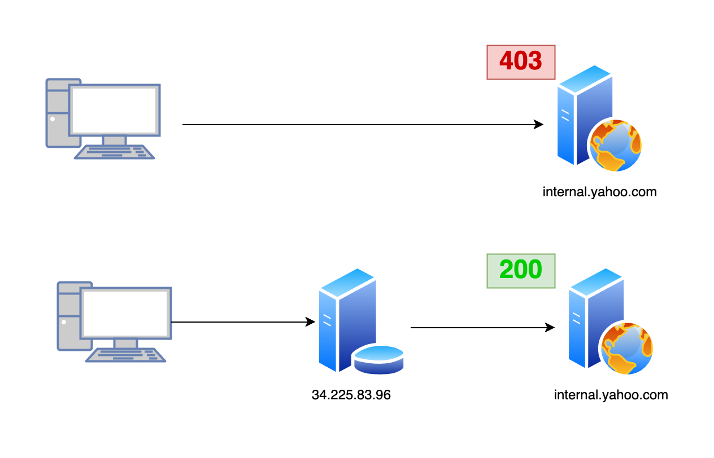

# GOROUTE

GOROUTE is a concurrent HTTP request tool written in Go. It allows you to route your requests via a Load Balancer / WAF to the domains behind it. It uses the Host Header technique while the request is directed to the load balancer's IP.

## Technique
You may ask, what is this and why it is exist in the first place. Well it translates the Virtual Host Enumeration that can be achieved via Host header manipulation.



## Installation

To install GOROUTE, you need to have Go installed. You can then run:

```bash
go install github.com/0xdead4f/goroute@latest
```

## Usage

```bash
  _____  ____  _____   ____  _    _ _______ ______ 
 / ____|/ __ \|  __ \ / __ \| |  | |__   __|  ____|
| |  __| |  | | |__) | |  | | |  | |  | |  | |__   
| | |_ | |  | |  _  /| |  | | |  | |  | |  |  __|  
| |__| | |__| | | \ \| |__| | |__| |  | |  | |____ 
 \_____|\____/|_|  \_\\____/ \____/   |_|  |______| v0.1
													
					By: 0xdead4f 

Usage of goroute:
  -host string
        File containing the list of hosts
  -domain string
        File containing the list of domain headers
  -t int
        Number of concurrent threads (default 10)
  -proxy string
        Proxy URL in the format https://IP:PORT
  -headers string
        JSON file containing custom headers
  -v 
        Verbose mode: show all request details
  -fcl int
        Filter responses by Content-Length (default 0)
```

## Example

```bash
goroute -host hosts.txt -domain domains.txt -t 5 -proxy https://127.0.0.1:8080 -headers headers.json -v -fcl 100
```


## License

This project is licensed under the MIT License - see the [LICENSE](LICENSE) file for details.
